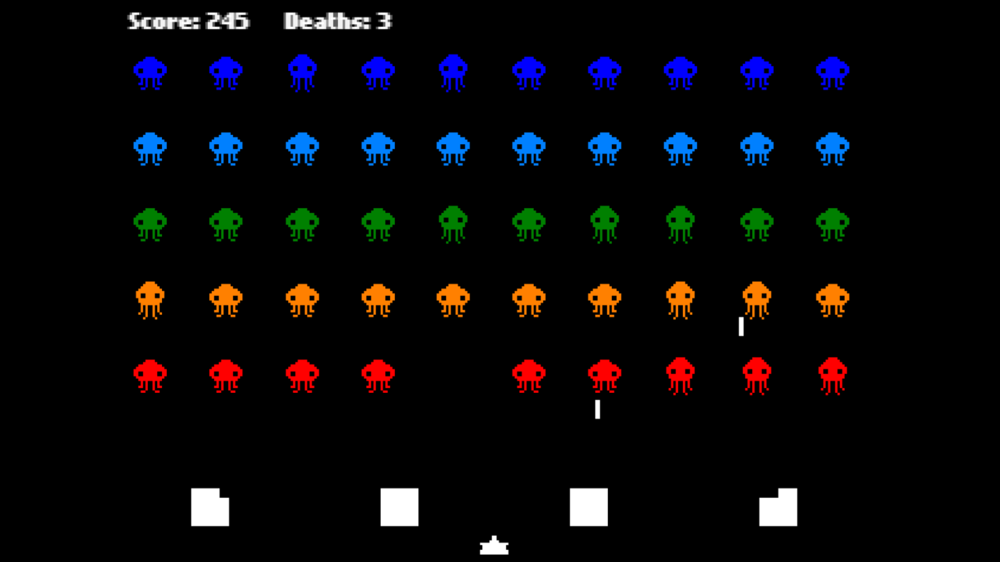

# Haxe Academic Rewrites & HaxeFlixel Space Invaders



## Description
This project is a collection of Haxe re-implementations of [@SPGLP](https://github.com/SPGLP)'s university Computer Science homework assignments (originally written in C/Java), together with a small HaxeFlixel Space Invaders clone as my personal side addition.

The two distinct parts of the project are:
1. **Academic Haxe Rewrites**: Standalone Haxe programs converted from [SPGLP's C/Java homework repository](https://github.com/SPGLP/C-APPLICATIONS-IN-SCHOOL).
2. **HaxeFlixel Space Invaders**: A custom, simplified Space Invaders clone (in the `FlxInvaders.Customized` folder).

## Included Academic Programs
All programs below are Haxe rewrites of university Computer Science assignments:
- `CylinderVolume.hx`: Calculate the volume of a cylinder.
- `DiamondShape.hx`: Print a diamond pattern to the console.
- `GradingExample.hx`: Simple student grading logic, especially converting scores to letter grades.
- `IncomeAfterTax.hx`: Calculate post-tax income, based on input salary or service fee.
- `StringComparator.hx`: Compare strings based on length and binary data.
- `StudentRecords.hx`: Store or retrieve basic student information.
- `SumWithHundreds.hx`: Sum two integers + display the hundreds digit of the result (if sum > 100).
- `TriangleCalculator.hx`: Compute triangle area and perimeter from side lengths.

## How to Run

### 1. Run the Academic Haxe Programs
These are self-contained `.hx` files (no extra dependencies needed beyond Haxe itself):
1. Install [Haxe](https://haxe.org/download/) (version 4.2+ recommended).
2. Open a terminal in the root of repository.
3. Run any program with:
   ```bash
   haxe --run [FILENAME].hx
   ```
   Example (to run the sum + hundreds-digit checker):
   ```bash
   haxe --run SumWithHundreds.hx
   ```

### 2. Play the HaxeFlixel Space Invaders
Requires Haxe + HaxeFlixel/lime (setup steps below):
1. First, install required Haxe libraries:
   ```bash
   haxelib install openfl
   haxelib install lime
   haxelib install flixel
   ```
2. Navigate to the game folder:
   ```bash
   cd FlxInvaders.Customized
   ```
3. Launch the game (runs in your browser):
   ```bash
   lime test html5
   ```
#### Game Controls:
- **Left/Right Arrow Keys**: Move your ship
- **Spacebar**: Fire bullets

#### Game Features:
- Real-time score tracking
- Player death counter
- No pause function (keep playing even if you die!)
- Endless waves (no "Game Over" screen)

## Personal Notes
I started working with Haxe (and HaxeFlixel) after hearing about some community upheaval around another popular game engine in September 2024. Let's just say I wanted a toolset that felt low-drama and focused only on building things. That's how I ended up keeping Haxe installed, and this repository grew out of that.

Rewriting these Computer Science homework assignments (originally in C/Java) wasn't anything fancy. It's just a low-pressure way to fill my free time and keep my coding muscles loose. It’s been a nice mental break lately, honestly.

As for what's next for me? Still up in the air. I'm torn between retaking the Postgraduate Entrance Exam for a Master's in Chinese Medicine, or jumping straight into full-time work. For now, though, I'm just taking it one project (and even one Haxe script) at a time.

## License
This project is licensed under the MIT License. See the [LICENSE](LICENSE) file for details.